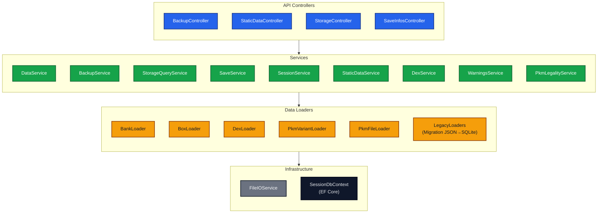

# Backend - Architecture

```mermaid

flowchart TD

classDef controller fill:#2563eb,stroke:#1e3a8a,stroke-width:2px,color:#fff;
classDef service fill:#16a34a,stroke:#166534,stroke-width:2px,color:#fff;
classDef loader fill:#f59e0b,stroke:#92400e,stroke-width:2px,color:#111827;
classDef infra fill:#6b7280,stroke:#111827,stroke-width:2px,color:#f9fafb;
classDef db fill:#0f172a,stroke:#020617,stroke-width:2px,color:#e5e7eb;

subgraph API [API Controllers]
    direction TB

    BackupController:::controller
    StaticDataController:::controller
    StorageController:::controller
    SaveInfosController:::controller
end

subgraph Services [Services]
    direction TB

    DataService:::service
    BackupService:::service
    StorageQueryService:::service
    SaveService:::service
    SessionService:::service
    StaticDataService:::service
    DexService:::service
    WarningsService:::service
    PkmLegalityService:::service
end

subgraph Loaders [Data Loaders]
    direction TB

    BankLoader:::loader
    BoxLoader:::loader
    DexLoader:::loader
    PkmVariantLoader:::loader
    PkmFileLoader:::loader
    LegacyLoaders["LegacyLoaders<br/>(Migration JSON→SQLite)"]:::loader
end

subgraph Infra [Infrastructure]
    direction TB

    FileIOService:::infra
    SessionDbContext["SessionDbContext<br/>(EF Core)"]:::db
end

API --> Services
Services --> Loaders
Loaders --> Infra

```
