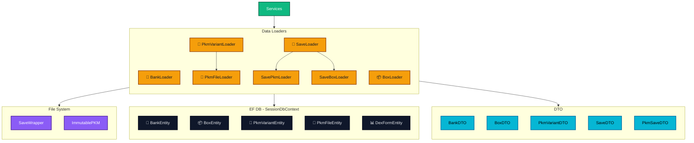

# Backend - Data structure

```mermaid

flowchart TD

classDef loader fill:#f59e0b,stroke:#92400e,stroke-width:2px,color:#111827;
classDef entity fill:#0f172a,stroke:#020617,stroke-width:2px,color:#e5e7eb;
classDef service fill:#10b981,stroke:#065f46,stroke-width:2px,color:#fff;
classDef file fill:#8b5cf6,stroke:#4c1d95,stroke-width:2px,color:#fff;
classDef dto fill:#06b6d4,stroke:#0369a1,stroke-width:2px,color:#000;
classDef relation fill:#ec4899,stroke:#831843,stroke-width:2px,color:#fff;
classDef cache fill:#f97316,stroke:#7c2d12,stroke-width:2px,color:#fff;

Services:::service

subgraph LoaderLayer [Data Loaders]
    direction TB

    BankLoader["🏦 BankLoader"]:::loader
    BoxLoader["📦 BoxLoader"]:::loader
    PkmVariantLoader["🔄 PkmVariantLoader"]:::loader
    PkmFileLoader["📄 PkmFileLoader"]:::loader
    SaveLoader["💾 SaveLoader"]:::loader
    SavePkmLoader["SavePkmLoader"]:::loader
    SaveBoxLoader["SaveBoxLoader"]:::loader
end

subgraph DBLayer [EF DB - SessionDbContext]
    direction TB

    BankEntity["🏦 BankEntity"]:::entity
    BoxEntity["📦 BoxEntity"]:::entity
    PkmVariantEntity["🔄 PkmVariantEntity"]:::entity
    PkmFileEntity["📄 PkmFileEntity"]:::entity
    DexFormEntity["📊 DexFormEntity"]:::entity
end

subgraph FileLayer [File System]
    direction TB

    SaveWrapper:::file
    ImmutablePKM:::file
end

subgraph DTOLayer [DTO]
    direction TB

    BankDTO:::dto
    BoxDTO:::dto
    PkmVariantDTO:::dto
    SaveDTO:::dto
    PkmSaveDTO:::dto
end

Services --> LoaderLayer
LoaderLayer --> FileLayer
LoaderLayer --> DBLayer
LoaderLayer --> DTOLayer

PkmVariantLoader --> PkmFileLoader
SaveLoader --> SavePkmLoader
SaveLoader --> SaveBoxLoader

```
