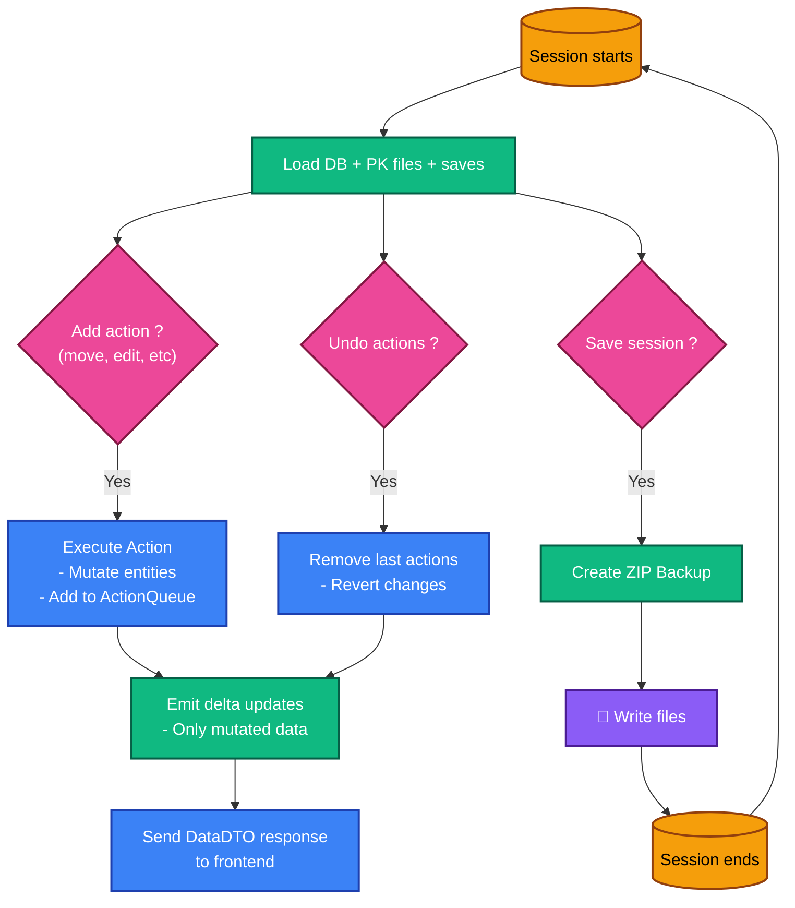

# Backend - Session lifecycle

```mermaid

flowchart TD

classDef action fill:#3b82f6,stroke:#1e40af,stroke-width:2px,color:#fff;
classDef service fill:#10b981,stroke:#065f46,stroke-width:2px,color:#fff;
classDef state fill:#f59e0b,stroke:#92400e,stroke-width:2px,color:#000;
classDef decision fill:#ec4899,stroke:#831843,stroke-width:2px,color:#fff;
classDef storage fill:#8b5cf6,stroke:#4c1d95,stroke-width:2px,color:#fff;

Start[("Session starts")]:::state
SessionInit["Load DB + PK files + saves"]:::service
ActionLoop{"Add action ?<br/>(move, edit, etc)"}:::decision
ActionExec["Execute Action<br/>- Mutate entities<br/>- Add to ActionQueue"]:::action
UndoCheck{"Undo actions ?"}:::decision
UndoAction["Remove last actions<br/>- Revert changes"]:::action
UpdateUI["Emit delta updates<br/>- Only mutated data"]:::service
SendResponse["Send DataDTO response<br/>to frontend"]:::action
ManualSave{"Save session ?"}:::decision
CreateSessionBackup["Create ZIP Backup"]:::service
WriteFiles["💾 Write files"]:::storage
End[("Session ends")]:::state

Start --> SessionInit

SessionInit --> ActionLoop
SessionInit --> UndoCheck
SessionInit --> ManualSave

ActionLoop -->|Yes| ActionExec
ActionExec --> UpdateUI

UndoCheck -->|Yes| UndoAction

UndoAction --> UpdateUI

ManualSave -->|Yes| CreateSessionBackup
CreateSessionBackup --> WriteFiles
WriteFiles --> End

UpdateUI --> SendResponse

End --> Start

```
