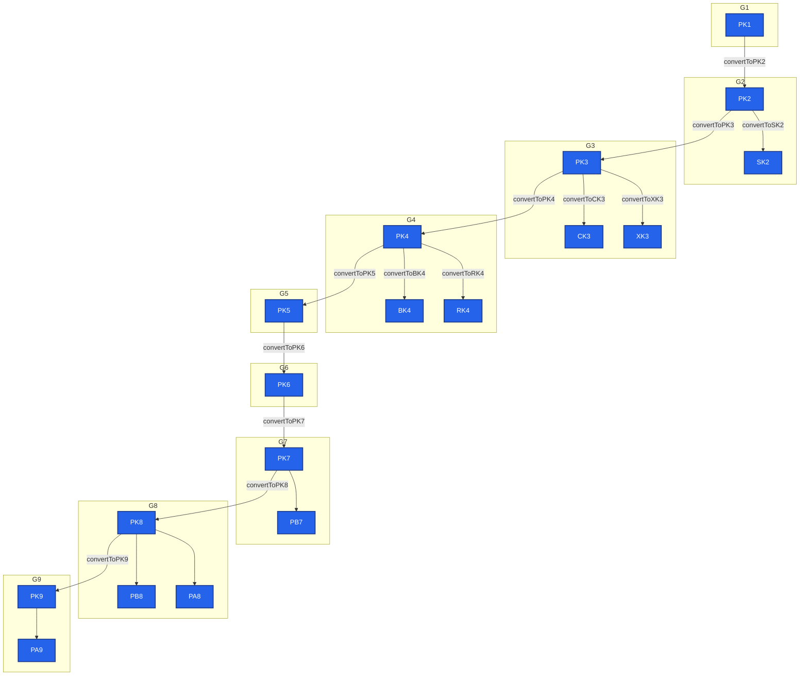

# PkmConvertService

Create a converted PKM copy from a game to another one.

Convert process is based on a chain of multiple conversions:

```mermaid

flowchart TD

classDef pkm fill:#2563eb,stroke:#1e3a8a,stroke-width:2px,color:#fff;

subgraph G1
    direction LR

    PK1:::pkm
end

subgraph G2
    direction LR

    PK2:::pkm
    SK2:::pkm

    PK2 --convertToSK2--> SK2
end

subgraph G3
    direction LR

    PK3:::pkm
    CK3:::pkm
    XK3:::pkm

    PK3 --convertToCK3--> CK3
    PK3 --convertToXK3--> XK3
end

subgraph G4
    direction LR

    PK4:::pkm
    BK4:::pkm
    RK4:::pkm

    PK4 --convertToBK4--> BK4
    PK4 --convertToRK4--> RK4
end

subgraph G5
    direction LR

    PK5:::pkm
end

subgraph G6
    direction LR

    PK6:::pkm
end

subgraph G7
    direction LR

    PK7:::pkm
    PB7:::pkm

    PK7 --> PB7
end

subgraph G8
    direction LR

    PK8:::pkm
    PB8:::pkm
    PA8:::pkm

    PK8 --> PB8
    PK8 --> PA8
end

subgraph G9
    direction LR

    PK9:::pkm
    PA9:::pkm

    PK9 --> PA9
end

PK1 --convertToPK2--> PK2
PK2 --convertToPK3--> PK3
PK3 --convertToPK4--> PK4
PK4 --convertToPK5--> PK5
PK5 --convertToPK6--> PK6
PK6 --convertToPK7--> PK7
PK7 --convertToPK8--> PK8
PK8 --convertToPK9--> PK9

%% PK1 --convertToPK7--> PK7
%% PK2 --convertToPK7--> PK7

```
