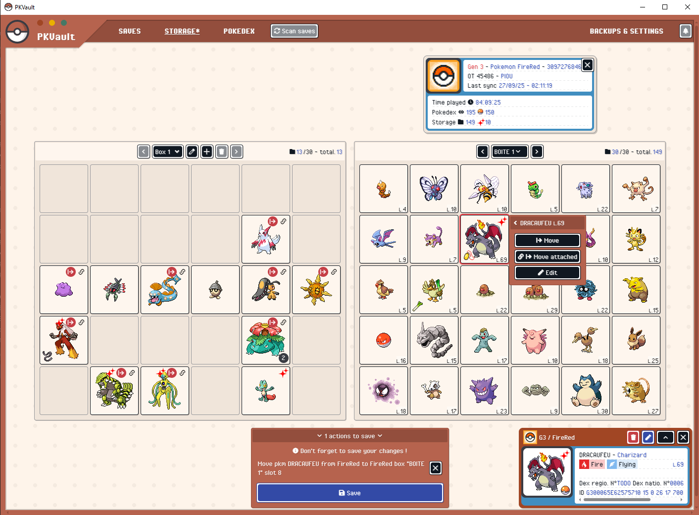
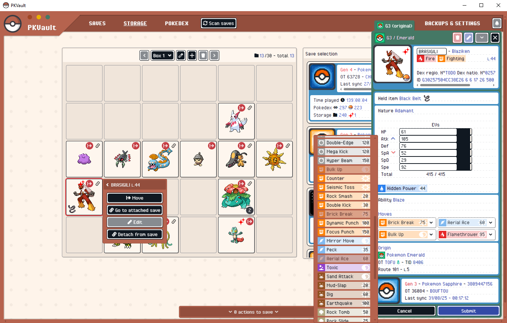
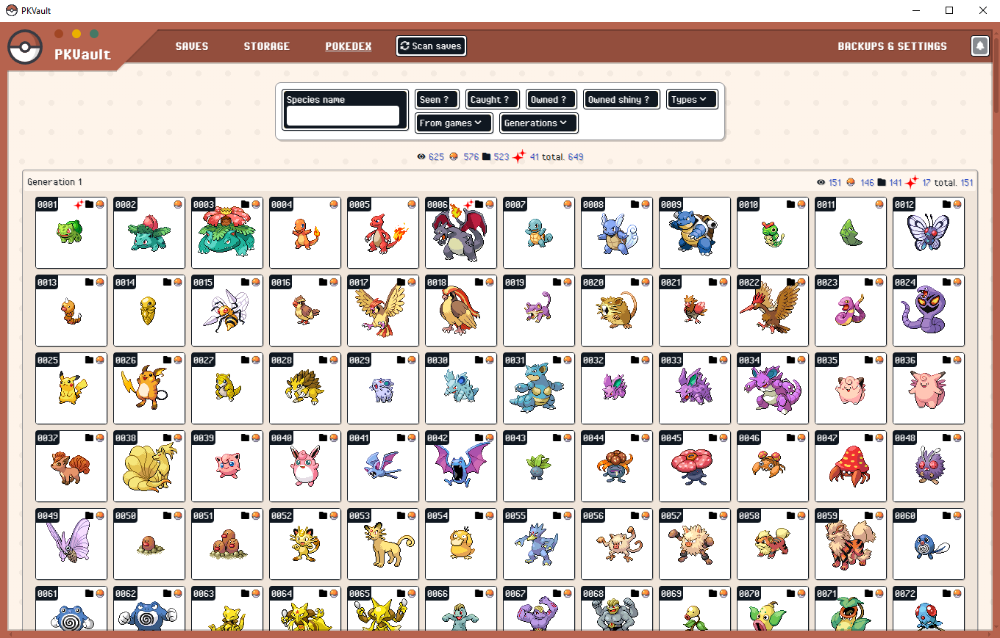
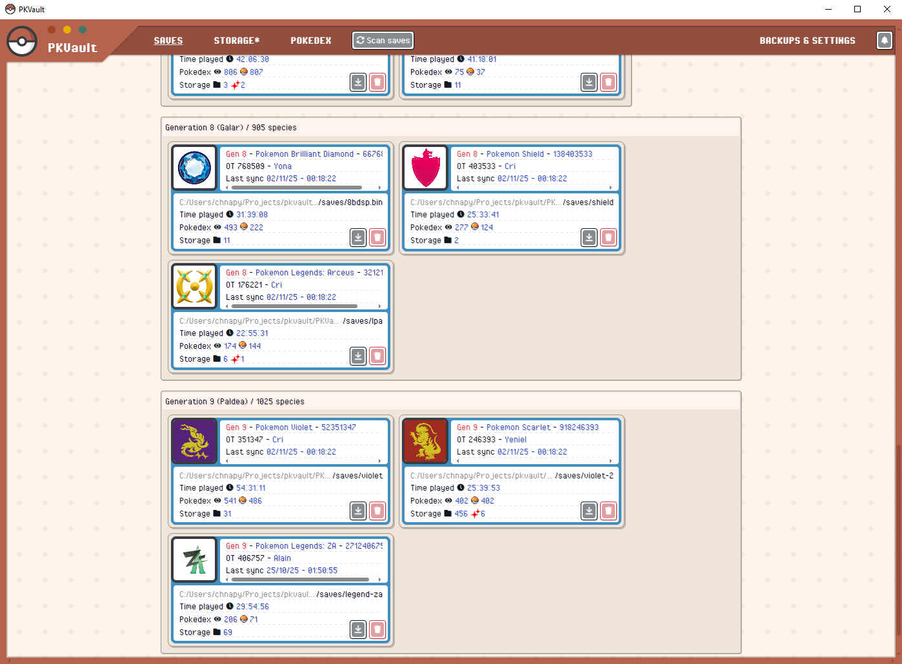
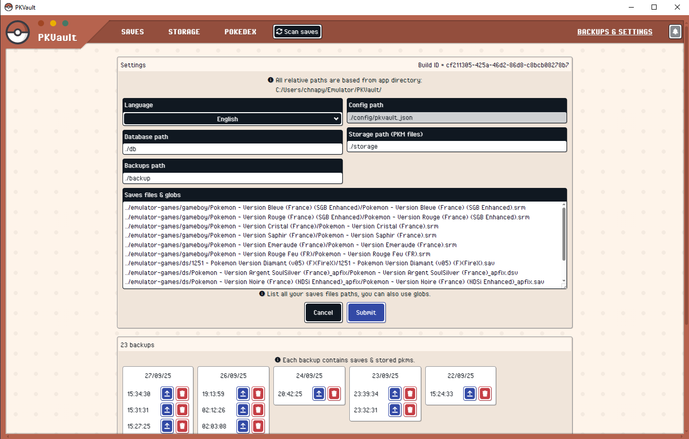

    

<h1 align="center">PKVault</h1>

<h6 align="center">
    <a href="https://github.com/Chnapy/PKVault/releases"><b>RELEASES</b></a>
    &nbsp;|&nbsp;
    <a href="https://projectpokemon.org/home/files/file/5766-pkvault/"><b>PROJECT POKEMON TOOL PAGE</b></a>
    &nbsp;|&nbsp;
    <a href="https://projectpokemon.org/home/forums/topic/67239-pkvault-centralized-pkm-storage-management-pokedex-app"><b>PROJECT POKEMON DISCUSSION PAGE</b></a>
</h6>

PKVault is a Pokemon storage & save manipulation tool based on [PKHeX](https://github.com/kwsch/PKHeX).
Similar to Pokemon Home, offline as online.

This tool can be used as:

- desktop Windows app ([PKVault.WinForm](./PKVault.WinForm))
- web app with C# backend ([PKVault.Backend](./PKVault.Backend)) and Typescript/React frontend ([frontend](./frontend)) for contexts like homelab

Executables can be found in releases.

    
    
    
    
    

## Bulk features

- Storage & save manipulation
  - compatible with all pokemon games, from first generation to **Pokemon Legends: Z-A**
  - transfer pokemons between saves
  - convert pokemon to any generation (ex. G7 to G2)
  - store pokemons outside saves using banks & boxes
  - allow use of multiple "versions" for stored pokemons
  - move/delete actions
  - edit pokemon moves, EVs & nickname
  - evolve pokemons requiring trade or trade + held-item (ex. Kadabra -> Alakazam)
  - link a save pokemon with all his versions, sharing data like exp & EVs
  - backup all saves & storage before any save action
    - backups listing
    - backups restore always possible
- Centralized Pokedex based on all listed saves
  - views with forms & genders
  - multiple filters: species name, seen/caught/owned, types, ...
    - possible living dex
    - possible shiny dex
- Dynamic saves listing based on paths & globs

## Get started as dev

You can target dev & build for desktop Windows app or web app.

> Editor note: all code & its documentation were made with/for VS Code. Any other editor may still work, without warranty.

### 1 - General preparation

- Clone this repository including submodules (pokeapi)
- Run the setup part in [PKVault.Backend/README.md](./PKVault.Backend/README.md#setup)
- Same with setup part in [frontend/README.md](./frontend/README.md#setup)

### 2a - Web app (backend + frontend)

- Run the dev part in [PKVault.Backend/README.md](./PKVault.Backend/README.md#dev)
- Same with dev part in [frontend/README.md](./frontend/README.md#dev)

### 2b - Desktop app (WinForm)

- From project root, run `make prepare-winform` (needs tool `make`)
- Run the setup & dev parts in [PKVault.WinForm/README.md](./PKVault.WinForm/README.md)

## Licenses

This app (PKVault) is licensed under GPLv3 terms, as described in file [LICENSE](./LICENSE).
Your can use this app for your own projects following license restrictions.

- Backend / WinForm

  - [PKHeX (Core part)](https://github.com/kwsch/PKHeX/tree/master/PKHeX.Core) - License GPLv3
  - PokeApiNet - License MIT
  - Versions & all others dependencies can be found into `*.csproj` files

- Frontend

  - Font "Pixel Operator" - from [onlinewebfonts](http://www.onlinewebfonts.com) - License CC BY 4.0
  - Font "Pokemon Emerald" - from [fontstruct](https://fontstruct.com/fontstructions/show/1975556) by "aztecwarrior28" - License CC BY-SA 3.0
  - [HackerNoon's Pixel Icon Library](https://github.com/hackernoon/pixel-icon-library) - License MIT
  - Versions & all others dependencies can be found into [frontend/package.json](./frontend/package.json).

All image contents of game-icons, pokemons, types, items, move-categories are Copyright The Pokémon Company.
