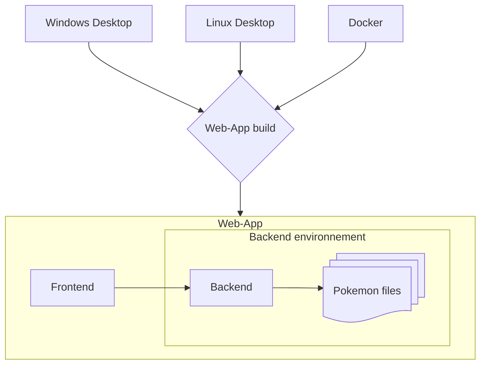

# PKVault - Technical

PKVault project is composed as so:

- a backend in C# .NET10
- a frontend in Typescript/React
- a desktop app in C# Photino

The core is the web app (backend & frontend).
Desktop app is just consuming the web app as a container using Photino for web rendering.

Check each package README for more technical documentation.

## Quick start

You can target dev & build for desktop Windows app or web app.

> Editor note: all code & its documentation were made with/for VS Code. Any other editor may still work, without warranty.

### 1 - General preparation

- Clone this repository including submodules (pokeapi)
- Run the setup part in [PKVault.Backend](../../PKVault.Backend/README.md#setup)
- Same with setup part in [frontend](../../frontend/README.md#setup)

### 2a - Web app (backend + frontend)

- Run the dev part in [PKVault.Backend](../../PKVault.Backend/README.md#dev)
- Same with dev part in [frontend](../../frontend/README.md#dev)

### 2b - Desktop app

- From project root, run `make prepare-desktop` (needs tool `make`)
- Run the setup & dev parts in [PKVault.Desktop](../../PKVault.Desktop/README.md)

## Add new language translations

You can add new language to PKVault if you're willing to make the translations.

Before going further, some disclaimers:

- Your new language may be partially supported if PKHeX/PokéApi do not support it (ex: Brazilian Portuguese). It will result in a mix between your language and English.

- AI usage is allowed on the condition that you check the generated code yourself and maintain good code quality.

It is assumed here that you have setup frontend and backend (no need to run them).

- Find your language code, in lowercase. Ex: `en`, `fr`, `pt-br`, `ko`, `ja-hrkt`, `zh-hant`, ...
For the following parts, we'll call it `xx`.

- Backend part

  - In `PKVault.Backend/settings/services/SettingsService.cs`, add your language code `xx` to `AllowedLanguages`.

  - Generate the StaticData files (as described in backend README). TL;DR: `dotnet run -p:Mode=gen-pokeapi`
  This operation can take a few minutes.

- Frontend part

  - In `frontend/src/translate/locales`, create `xx.json` with the content `{}` for now.

  - In `frontend/src/translate/i18n.ts`, add your language to `resources` and `languages` variables.

  - Run `c:translate:fix` - this command will check your translations & add missing keys with the placeholder values `TBD`.

  - Then you just have to add your translations values, based on other translation files (`en.json`, `fr.json`, ...).
  Use `c:translate` at any moment to see if there is missing values.

- Publish your changes and open a PR ! 
